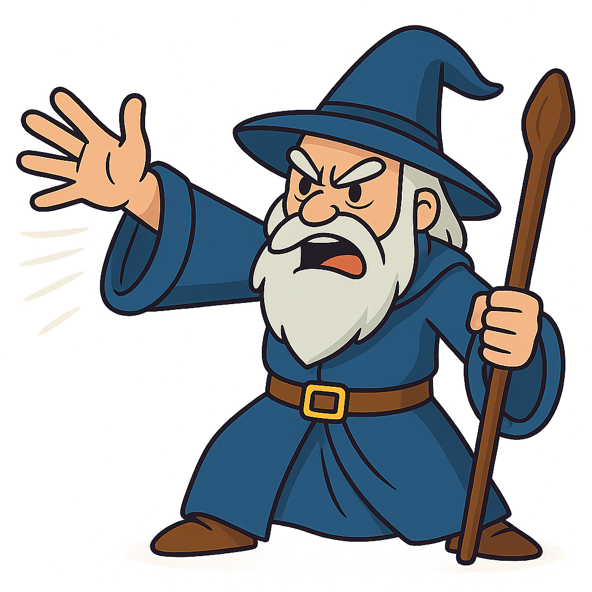

---

<!--Languages and Tools Section-->       
<h2 align="center">𝕰𝖛𝖔𝖑𝖛𝖎𝖓𝖌 𝕾𝖐𝖎𝖑𝖑𝖘</h2> 
<picture>
  <source media="(prefers-color-scheme: dark)" srcset="./Skills_Animation_Dark.gif">
  <source media="(prefers-color-scheme: light)" srcset="./Skills_Animation_White.gif">
  
</picture>
 

<h3 align="left">Current Learning</h3>
<ul align="left">
  <li>Developing applications with React Native, focusing on computer vision.</li>
  <li>Exploring concepts of AI, blockchain, science, and philosophy to broaden my technological and critical perspective.</li>
</ul>
 

    
  

