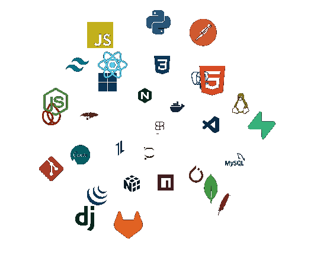

---

<!--Languages and Tools Section-->       
<h2 align="center">𝕰𝖛𝖔𝖑𝖛𝖎𝖓𝖌 𝕾𝖐𝖎𝖑𝖑𝖘</h2> 

### 🔭 Current Focus 🚀
<ul align="left">
  🔹Developing applications with React Native, focusing on computer vision. 
  🔹Exploring concepts of AI, blockchain, science, and philosophy to broaden my technological and critical perspective.
</ul>

---

  

<picture>
  
</picture>
   

